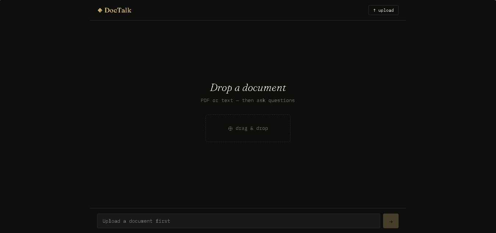
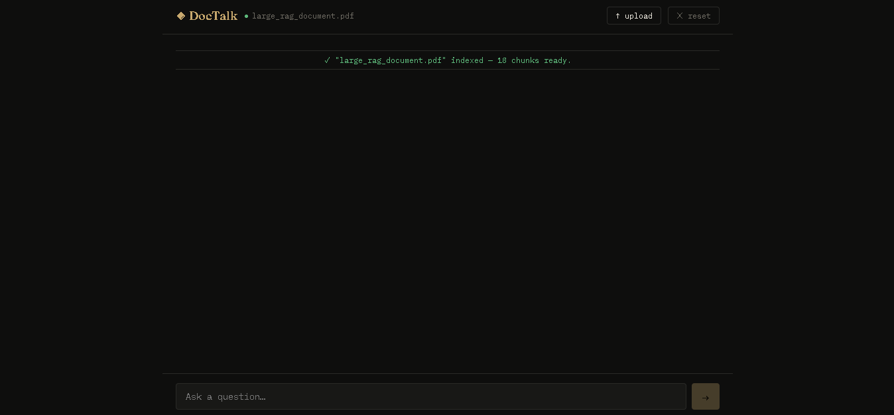
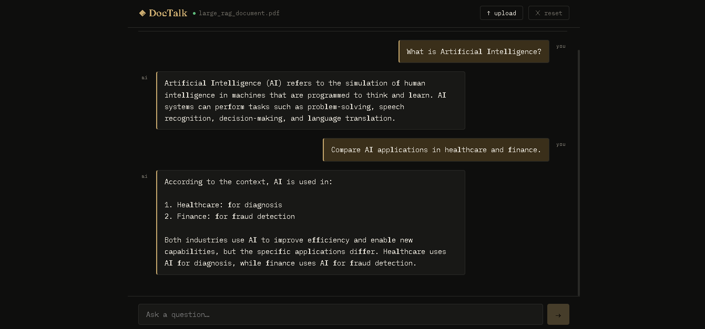

# doc-talk

Chat with your documents in real time using a RAG pipeline, LangChain, GraphQL, and WebSocket streaming.

## Usage

1. Upload a PDF or text file (button or drag & drop)
2. Ask questions — the answer streams token by token in real time
3. Conversation history is preserved between questions

## Screenshots




## Stack

- **Backend** : FastAPI + Strawberry (GraphQL) + LangChain + ChromaDB + OpenAI
- **Frontend** : React + Apollo Client + graphql-ws
- **Runtime** : Python 3.11.9

## Why GraphQL Subscriptions for streaming?

GraphQL does not natively support HTTP streaming. The standard solution is to use **Subscriptions** over WebSocket:
- Each LLM token is emitted as a `TokenEvent { token, done }` event
- Apollo Client connects via WebSocket and accumulates tokens in real time

## GraphQL Schema

```graphql
type Mutation {
  uploadDocument(file: Upload!): UploadResult!
  resetMemory: String!
}

type Subscription {
  ask(question: String!): TokenEvent!
}

type TokenEvent {
  token: String!
  done: Boolean!
}
```

## Getting Started

### Backend
Make Sure to have python 3.11
```bash
cd backend
py -3.11 -m venv venv  && source .venv/bin/activate
pip install -r requirements.txt
# Add your OPENAI_API_KEY to .env
uvicorn main:app --reload
```

### Frontend

```bash
cd frontend
npm install
npm run dev
```

---
## 👤 Author

**Souhail HMAHMA** — Full Stack Developer

🌐 [souhail3.vercel.app](https://souhail3.vercel.app) · 💼 [LinkedIn](https://linkedin.com/in/souhail-hmahma) · 🐙 [GitHub](https://github.com/souhmahma)

